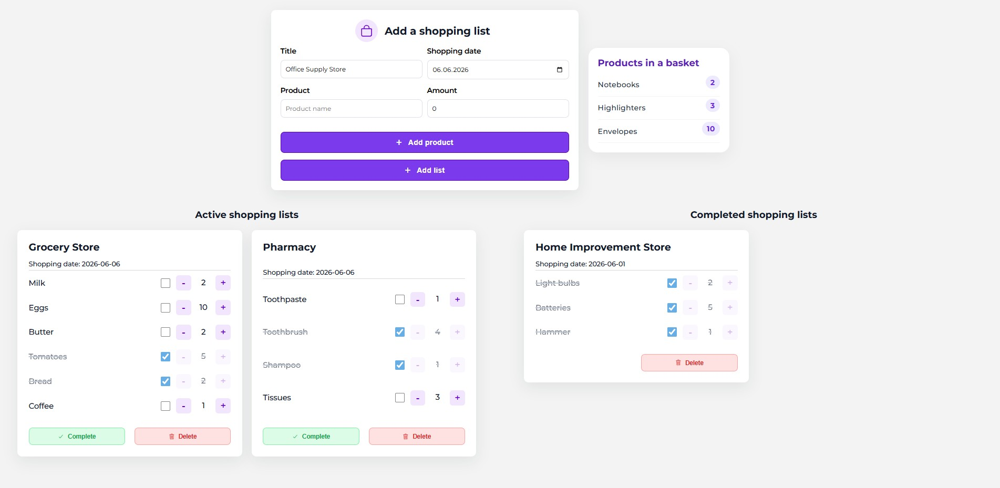

# 🛒 Shopping List App

A responsive shopping list management application built with React. The app allows users to create shopping lists, manage products, track purchased items, and organize lists into active and completed sections.

## 📸 Preview



## ✨ Features

### Shopping List Management

- Create shopping lists with a custom title
- Set a shopping date
- Add multiple products to a single shopping list
- Display active shopping lists
- Move completed lists to a dedicated section
- Delete shopping lists

### Product Management

- Add products with custom quantities
- Increase and decrease product quantity
- Mark products as purchased
- Disable quantity controls for purchased products
- Preview products before creating a shopping list

### User Experience

- Form validation
- Success and error notifications
- Responsive design
- Clean and intuitive interface

## 🛠️ Technologies

- React
- JavaScript (ES6+)
- React Hooks (`useState`)
- React Toastify
- CSS3
- Ionicons

## 🚀 Installation

Clone the repository:

```bash
git clone https://github.com/Karolina-S-dev/React-shopping-list.git
```

Navigate to the project directory:

```bash
cd shopping-list
```

Install dependencies:

```bash
npm install
```

Start the development server:

```bash
npm start
```

## 📋 How to Use

### Creating a Shopping List

1. Enter a shopping list title.
2. Select a shopping date.
3. Add products and quantities.
4. Click **Add Product** to add multiple products.
5. Click **Add List** to create the shopping list.

### Managing Products

- ➕ Increase quantity
- ➖ Decrease quantity
- ☑️ Mark as purchased

Purchased products become visually distinguished and their quantity controls are disabled.

### Managing Shopping Lists

- ✅ Complete a shopping list
- 🗑️ Delete a shopping list

Completed shopping lists are automatically displayed in a separate section.

## 📱 Responsive Design

The application is fully responsive and optimized for:

- Desktop devices
- Tablets
- Mobile devices

## 🔍 Validation

The application prevents users from:

- Creating a list without a title
- Creating a list without a shopping date
- Adding products without a name
- Adding products with invalid quantities

Validation messages are displayed using React Toastify notifications.

## 🧠 What I Learned

During this project I practiced:

- Component-based architecture in React
- State management using React Hooks (`useState`)
- Lifting state up between components
- Conditional rendering
- Dynamic list rendering
- Form handling and validation
- Event handling
- Responsive layouts with CSS
- User feedback with notifications

Additionally, the project was built without state management libraries such as Redux, relying entirely on React Hooks and component communication.

## 👩‍💻 Author

**Karolina-S-dev**
